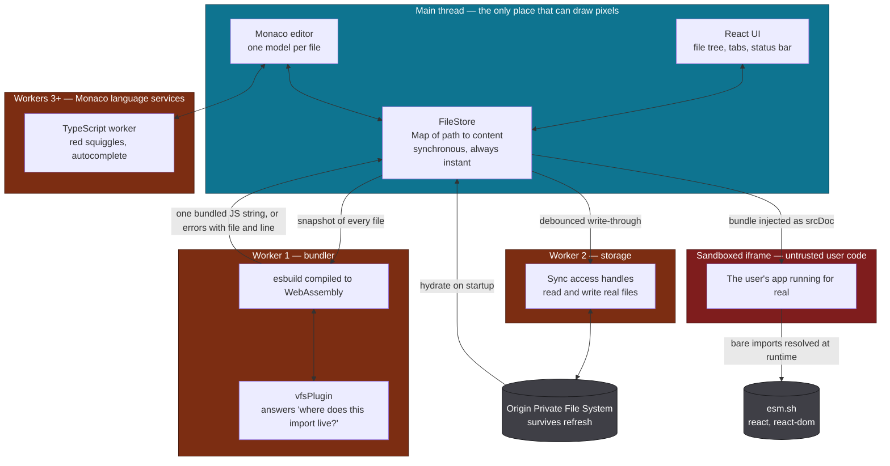
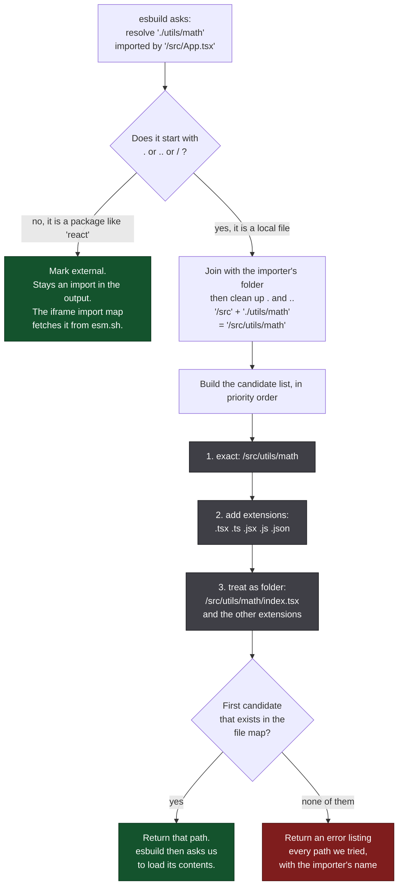
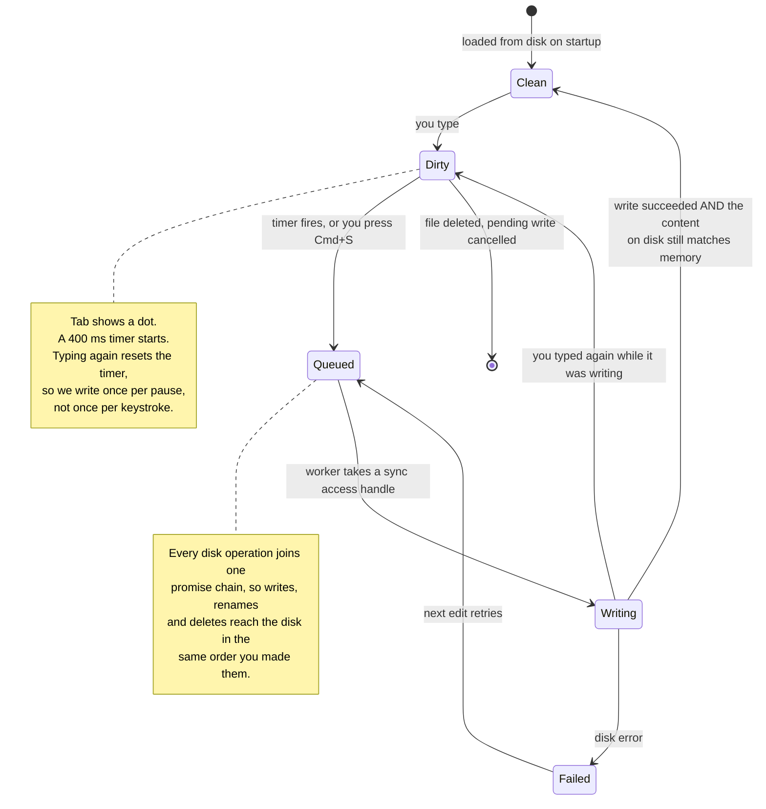
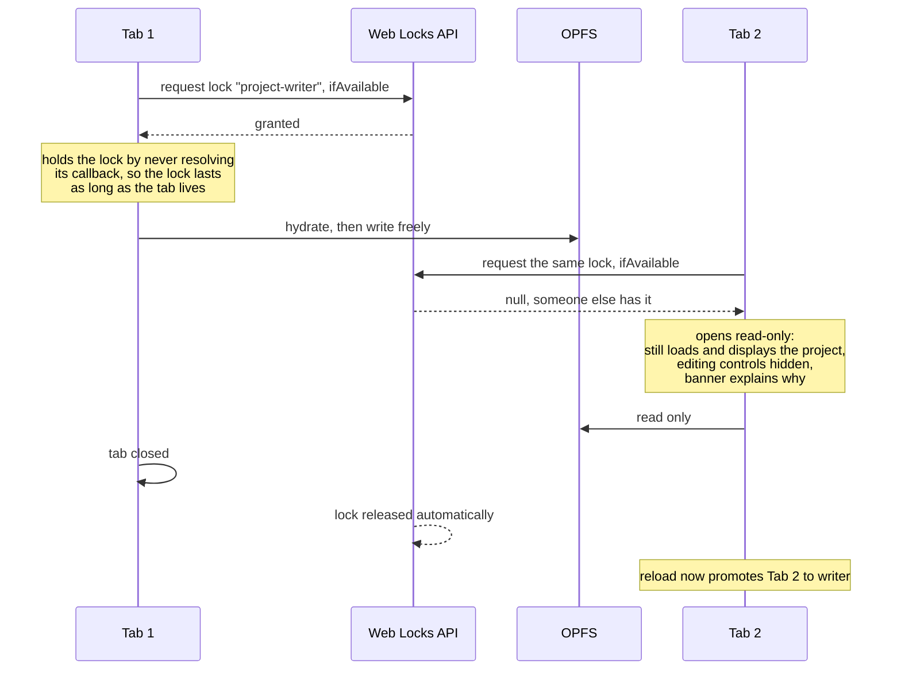
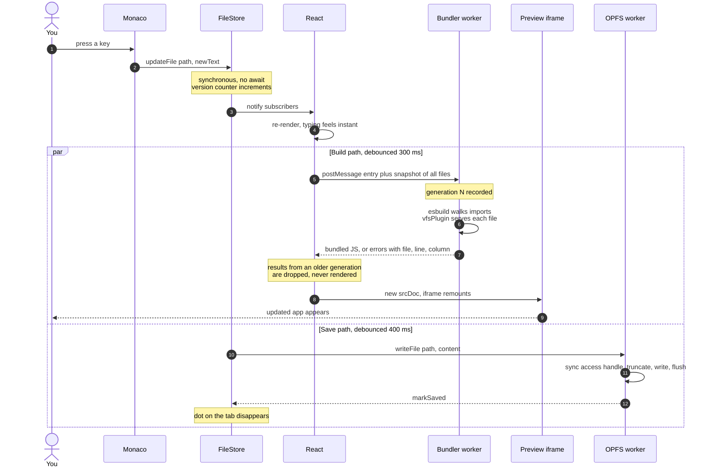

# Web Code

A code editor that lives in your browser tab, compiles a real multi-file React
project, and shows you the running app next to it. No server. No Docker. No
"npm install". Everything below happens on your own machine, inside one tab.

Think CodeSandbox or StackBlitz, built from scratch.

```
┌──────────┬────────────────────────┬──────────────────┐
│ EXPLORER │ main.tsx  App.tsx ●    │                  │
│  ▾ src   │                        │   Hello, World!  │
│    ▾ com │  export default        │   [-] 3 [+]      │
│      Cou │    function App() {    │                  │
│    ▾ uti │      return <h1>...    │                  │
│      for │    }                   │                  │
│    App   │                        │                  │
│    main  │                        │                  │
├──────────┴────────────────────────┴──────────────────┤
│ Build OK          5 files   All changes saved        │
└──────────────────────────────────────────────────────┘
```

---

## Table of contents

1. [Why this is harder than it looks](#1-why-this-is-harder-than-it-looks)
2. [Words you need first](#2-words-you-need-first)
3. [The big picture](#3-the-big-picture)
4. [Part one: the file store](#4-part-one-the-file-store)
5. [Part two: the bundler](#5-part-two-the-bundler)
6. [Part three: saving to disk](#6-part-three-saving-to-disk)
7. [Part four: the preview](#7-part-four-the-preview)
8. [What happens when you press a key](#8-what-happens-when-you-press-a-key)
9. [The hard problems, and how each one is solved](#9-the-hard-problems-and-how-each-one-is-solved)
10. [Map of the code](#10-map-of-the-code)
11. [Running it](#11-running-it)
12. [How it is tested](#12-how-it-is-tested)
13. [What is not built yet](#13-what-is-not-built-yet)

---

## 1. Why this is harder than it looks

Showing a text box and an iframe is a weekend project. The difficulty starts
the moment you allow a **second file**.

When you write this:

```tsx
// /src/App.tsx
import Counter from './components/Counter'
```

a browser has no idea what `./components/Counter` means. There is no disk to
look at. There is no Node.js to ask. `./components/Counter` is not even a real
filename, because the actual file is `Counter.tsx` and you did not type the
extension.

Somebody has to:

1. Figure out that `./components/Counter` means `/src/components/Counter.tsx`.
2. Read that file.
3. Notice that *it* imports things too, and repeat.
4. Turn all that TypeScript and JSX into plain JavaScript the browser can run.
5. Staple it into one file, in the right order.
6. Do all of this again, fast, every time you type.
7. Not freeze the editor while doing it.
8. Remember your files after you close the tab.

That "somebody" is normally a build tool running on a server. Here, it is this
project, running in your browser. That is the whole challenge.

---

## 2. Words you need first

Five browser features do the heavy lifting. If you know these, the rest of the
README is easy.

| Word | What it actually means | Plain analogy |
|---|---|---|
| **Web Worker** | A second JavaScript thread. It cannot touch the screen, and it talks to the main thread by posting messages. | A second cook in the kitchen. They can chop vegetables while you serve customers, but they can't walk into the dining room. |
| **WebAssembly (WASM)** | A way to run code written in Go, Rust or C++ inside a browser, at near-native speed. | A program compiled for a machine that every browser pretends to be. |
| **OPFS** (Origin Private File System) | A real, private filesystem the browser gives to your website. Files survive refresh and closing the tab. | A small hard drive that belongs to your site and nobody else's. |
| **iframe sandbox** | A page inside your page, deliberately stripped of powers. It cannot read your cookies, your storage, or your variables. | A glass box. You can watch what's inside, and it can't reach out. |
| **Import map** | A note in an HTML page saying "when code asks for `react`, fetch it from this URL instead". | A redirect table for import statements. |

Two more terms used throughout:

- **Bundling**: following every import from a starting file and combining them
  all into one JavaScript file.
- **Debouncing**: waiting until someone stops doing a thing before reacting.
  You don't rebuild on every keystroke. You wait for a pause.

---

## 3. The big picture

Four separate "places" run at the same time. Keeping them in sync *is* the
architecture.



The single most important design rule:

> **The editor must never wait for anything.**

Typing has to feel instant. Compiling and saving are allowed to be slow. So
everything fast lives on the main thread in plain memory, and everything slow
is pushed into a worker and made to catch up later. Every design decision in
this project comes back to that sentence.

---

## 4. Part one: the file store

📄 [`src/fs/fileStore.ts`](src/fs/fileStore.ts)

The project is held in memory as a flat map:

```ts
{
  "/src/main.tsx":              "import App from './App'…",
  "/src/App.tsx":               "export default function App…",
  "/src/components/Counter.tsx": "…",
  "/src/utils/format.ts":       "…",
}
```

### Why flat, and not a tree?

A folder tree feels natural, but almost everything we do is a **lookup by full
path**: "does `/src/utils/math.ts` exist?" A flat map answers that in one step.
A tree would need you to walk down from the root every time.

Folders are not stored at all. `/src/utils/format.ts` *implies* that `/src` and
`/src/utils` exist. The only exception is a folder you created but haven't put
anything in yet, which is kept in a small separate set until a file lands in
it. The visual tree you see in the sidebar is rebuilt from the flat map on
every render by [`buildTree.ts`](src/fs/buildTree.ts), which is cheap and means
the tree can never disagree with reality.

### What the store is responsible for

- **Create, update, rename, delete.** Renaming a folder re-keys every file
  underneath it. Deleting a folder deletes every descendant.
- **Guard rails.** Paths are validated, so `/src/../../etc/passwd` and
  `/src//weird` are rejected rather than silently normalised into something
  surprising.
- **Dirty tracking.** The store keeps a second map of "what we last wrote to
  disk". A file is *dirty* when the two disagree. That's the dot on the tab.
- **Change events.** Every mutation emits a typed event like
  `{ type: "rename", from, to, isFolder: true }`. Three separate systems
  listen: Monaco's models, the disk writer, and the tab bar. None of them
  knows about the others. Adding a fifth listener later costs nothing.

### One subtle detail worth understanding

React's `useSyncExternalStore` requires that if nothing changed, you hand back
the **exact same object** you handed back last time. If you return a fresh
`{...}` every call, React thinks something changed, re-renders, asks again,
gets another fresh object, and loops forever.

So the store caches its snapshot and only throws the cache away when a real
mutation happens. There's a unit test for exactly this, because it is the kind
of bug that produces a frozen browser tab and no error message.

---

## 5. Part two: the bundler

📄 [`src/workers/bundler.worker.ts`](src/workers/bundler.worker.ts) ·
[`src/bundler/vfsPlugin.ts`](src/bundler/vfsPlugin.ts) ·
[`src/fs/resolve.ts`](src/fs/resolve.ts)

We use **esbuild**, a bundler written in Go, compiled to WebAssembly so it runs
in the browser. It is genuinely fast: a small project rebuilds in a few
milliseconds.

But esbuild was built to read files from a hard drive, and we don't have one.
It wants to call the operating system, and there is no operating system here.

### The plugin: lying to esbuild, politely

esbuild has a plugin system with two hooks that matter:

- `onResolve` — "I found the text `./components/Counter`. What file is that?"
- `onLoad` — "Okay, give me the contents of that file."

Our plugin answers both from the in-memory map. esbuild never learns that the
disk doesn't exist.

```ts
build.onResolve({ filter: /.*/ }, (args) => { /* path or 'external' */ })
build.onLoad({ filter: /.*/, namespace: "vfs" }, (args) => files[args.path])
```

### Answering "what file is that?"

This is the fiddly part, and it is pure logic with no browser involved, which
is why it lives in its own file with its own tests.



Order matters and is not arbitrary. If both `math.ts` and `math.js` exist,
TypeScript wins, matching what every real bundler does. If you write
`./Button.tsx` and a file literally called `Button.tsx.tsx` exists, the exact
match wins first. These sound like edge cases until a user hits one and files a
bug.

### Two kinds of import, two different fates

| You write | What happens | Why |
|---|---|---|
| `import Counter from './components/Counter'` | Resolved, loaded, and **inlined** into the bundle | It's your code. We have it. |
| `import { useState } from 'react'` | Marked **external**. Stays as an `import` statement in the output. | React is 300 KB. Bundling it on every keystroke would be wasteful. The iframe's import map fetches it once from a CDN and the browser caches it. |

This split is why a rebuild takes milliseconds instead of seconds.

### Errors are data, not strings

When a build fails, the worker doesn't send back a blob of text. It sends a
list of objects:

```ts
{ text: 'Cannot find module "./Nope" from "/src/App.tsx"',
  file: "/src/App.tsx", line: 1, column: 18, lineText: "import Nope from './Nope'" }
```

Because the error is structured, the UI can render it as a clickable link that
opens the right file and puts your cursor on the right character. A small thing
that makes the tool feel real.

---

## 6. Part three: saving to disk

📄 [`src/workers/fs.worker.ts`](src/workers/fs.worker.ts) ·
[`src/fs/persistence.ts`](src/fs/persistence.ts) ·
[`src/fs/bootstrap.ts`](src/fs/bootstrap.ts)

Your project has to still be there tomorrow. OPFS gives us real files, but with
two awkward properties:

1. **Every operation is asynchronous.** You must `await` even to read one byte.
   Monaco cannot await. It needs text *now*.
2. **The fast API only works in a worker.** `createSyncAccessHandle()` is
   worker-only. The alternative, `createWritable()`, works on the main thread
   but isn't supported in Safari.

So there are two layers: memory is the *working copy*, disk is the *backup*.



Three rules keep this honest:

- **Content edits are debounced; structural changes are not.** Creating,
  renaming and deleting go to disk immediately, because they're rare and
  important. Typing waits for a pause.
- **One queue.** Every disk operation joins a single promise chain. Without
  this, a delete could overtake a write and the file would come back from the
  dead.
- **Cancel before you destroy.** Deleting a file first cancels any pending
  write for it. Renaming first *flushes* pending writes, so the rename carries
  your latest text, not an old copy.

### Two tabs, one project

Open the app twice and both tabs see the same OPFS. Both would try to write.
Sync access handles are exclusive, so one tab would start throwing errors and
your project could end up half-written.

The **Web Locks API** solves this in about fifteen lines:



The trick: `navigator.locks.request()` holds the lock for as long as your
callback's promise is pending. Return a promise that never resolves, and you
hold it until the tab closes. The browser releases it for you on crash or
close, which is exactly the behaviour you want and would be painful to build
yourself.

---

## 7. Part four: the preview

📄 [`src/services/iframeTeemplate.ts`](src/services/iframeTeemplate.ts) ·
[`src/components/PreviewFrame.tsx`](src/components/PreviewFrame.tsx)

The bundle is other people's code. It could be anything. So it runs inside an
iframe with:

```html
<iframe sandbox="allow-scripts" srcdoc="…">
```

`allow-scripts` lets it run. The critical part is what's **missing**:
`allow-same-origin`. Without it the iframe is treated as a foreign origin, so
the user's code cannot read our localStorage, our OPFS, our cookies, or reach
into our page. Even an infinite loop only freezes the preview.

Inside, an import map redirects bare imports:

```html
<script type="importmap">
  { "imports": { "react": "https://esm.sh/react@19", … } }
</script>
```

Then the bundle is imported as a module and its default export is mounted.

### A real bug that lived here

The original code pasted the compiled JavaScript into a template literal and
escaped only backticks. That meant a user writing this perfectly normal line:

```ts
const greet = (n: string) => `Hello, ${n}!`
```

produced `${n}` *inside our own template literal*, so **our** page tried to
evaluate `n`, and the preview died with "n is not defined". The user's code was
fine. Our string handling was not.

The fix is to never hand-escape code. `JSON.stringify()` produces a valid
JavaScript string literal for any input whatsoever, and `<` is additionally
escaped so that a `</script>` inside user code cannot close our script tag
early. Two lines, one whole class of bug gone.

### Errors don't blank the screen

When a build fails, the last working bundle keeps running and the errors appear
in an overlay on top. This matters more than it sounds. If the preview went
blank every time you had a half-typed line, the tool would be unusable.

---

## 8. What happens when you press a key

Putting it together. Notice that two things happen in parallel, at different
speeds, and neither blocks your typing.



---

## 9. The hard problems, and how each one is solved

This is the section to read if you want to understand why the code looks the
way it does. Every one of these is a bug that happened, or would have.

### Stale builds overwriting fresh ones

**The problem.** You type fast. Build A starts. You type again, build B starts.
Build B happens to finish first, then A finishes and overwrites it. Your
preview now shows older code than you have on screen, and it stays wrong until
you type again.

**The fix.** Every build takes a *generation number*. When a result comes back,
we check whether a newer build has started since. If so, the result is thrown
away without touching the screen. Correctness no longer depends on the order
replies arrive in.

```ts
const myGen = ++generation.current
const result = await bundlerService.bundle(entry, snapshot)
if (generation.current !== myGen) return   // stale, ignore
```

### Two first builds racing each other

**The problem.** esbuild's WASM module must be initialised exactly once. Calling
`initialize()` twice throws. A naive `if (initialized) return` guard doesn't
help, because two requests can both arrive while the first `await` is still
pending. Both see `false`.

**The fix.** Cache the **promise**, not a boolean. The second caller awaits the
same promise the first one created. This pattern shows up constantly once you
notice it.

### The save that clears the wrong flag

**The problem.** We write version 2 of a file. While the disk is busy, you type
version 3. The write finishes and we mark the file "saved". The dot disappears,
but disk still has version 2.

**The fix.** `markSaved(path, content)` records *what was written*, and dirty is
computed by comparing memory to that value. If they differ, the file stays
dirty and gets written again. There is a unit test named after this exact
scenario.

### React StrictMode running everything twice

**The problem.** In development React mounts effects, unmounts, and mounts
again to catch bugs. A naive setup spawns two bundler workers, two OPFS
workers, and seeds the template twice.

**The fix.** Every expensive thing is a module-level singleton, and startup is
an idempotent cached promise. Calling `initWorkspace()` five times boots once.

### The invisible-edge problem in the UI

**The problem.** The editor and preview were fixed halves of the screen with no
minimum width, so long lines of code slid underneath the preview pane and
became unreachable.

**The fix.** Drag handles between the panes, `min-width: 0` plus hidden overflow
on the editor so it can never exceed its share, and sizes saved to
localStorage. The explorer is stored in pixels; the preview is stored as a
*fraction*, so it stays proportional when you resize the window. Drag handles
also use pointer capture, because an iframe normally swallows mouse events the
moment your cursor crosses into it.

### Renaming a file that is currently being saved

**The problem.** OPFS has no rename. You must copy, then delete. If a debounced
write for the old path fires in between, you resurrect the file you just moved.

**The fix.** Renaming first flushes pending writes for anything under the old
path, then queues copy-and-delete on the same ordered chain. Deleting cancels
pending writes instead, since there's nothing to preserve.

---

## 10. Map of the code

Roughly 3,100 lines, including tests.

| Folder | What lives there |
|---|---|
| [`src/fs/`](src/fs/) | The filesystem: path maths, resolver, store, tree builder, OPFS client, write-through persistence, startup. No React, no UI. |
| [`src/bundler/`](src/bundler/) | The esbuild plugin and the worker message types. |
| [`src/workers/`](src/workers/) | The two background threads: bundler and disk. |
| [`src/services/`](src/services/) | Main-thread wrappers around workers, Monaco setup, the iframe HTML template. |
| [`src/hooks/`](src/hooks/) | React bindings: subscribe to the store, run the bundler, track tabs and save status. |
| [`src/components/workspace/`](src/components/workspace/) | The UI pieces: explorer, tabs, editor pane, status bar, drag handles. |
| [`Concept/`](Concept/) | Design diagrams, in Mermaid source plus rendered PNG and SVG. |

### Files worth reading first, in order

1. [`src/fs/resolve.ts`](src/fs/resolve.ts) — 54 lines, pure logic, the heart of
   a bundler. Read the tests next to it too.
2. [`src/fs/fileStore.ts`](src/fs/fileStore.ts) — how state is held and
   broadcast.
3. [`src/bundler/vfsPlugin.ts`](src/bundler/vfsPlugin.ts) — how esbuild is
   convinced there is a disk.
4. [`src/fs/persistence.ts`](src/fs/persistence.ts) — debouncing, ordering and
   cancellation.

---

## 11. Running it

```bash
npm install
npm run dev        # http://localhost:5173
```

Other commands:

```bash
npm test           # unit and integration tests
npm run lint       # eslint
npm run build      # typecheck, then production build
```

Things to try once it's open:

- Add a file under `src/utils`, export a function, import it in `App.tsx`, and
  watch the preview update.
- Break an import on purpose. Click the red error and watch it jump to the
  exact character.
- Refresh the page. Your files are still there.
- Open the app in a second tab and read the banner at the top.

Two notes on the repo: `/src/main.tsx` is the entry point and must default-export
a React component. Also, both `package-lock.json` and `yarn.lock` are currently
committed. Pick one and delete the other.

---

## 12. How it is tested

Three layers, each catching a different kind of mistake.

| Layer | Tool | What it proves |
|---|---|---|
| Unit | Vitest | Path maths, resolution rules and store mutations behave correctly, including the awkward cases: `..` escaping the root, `.ts` beating `.js`, deleting a folder not touching a similarly-named sibling. |
| Integration | Vitest + real esbuild | A four-file project with a JSON import and a folder `index` file actually bundles, React stays external, and a missing import produces the right message at the right line. Not a mock. |
| End to end | Playwright + Chrome | The full loop in a real browser: seed, edit, create, import, break, fix, rename, delete, reload, and a second tab going read-only. |

Current state: **44 unit and integration tests**, and **26 browser checks**.

The end-to-end suite is the one that found the `${n}` escaping bug, because it
was the only layer that ran real user code in a real iframe.

---

## 13. What is not built yet

This is phase one of a longer plan. Deliberately missing:

- **npm packages.** Only what the import map lists (React) is available. Real
  support means fetching from a CDN, following each package's own imports,
  honouring its `exports` map, and caching it all.
- **CSS and asset imports.** `import './app.css'` resolves, then fails with a
  clear message rather than silently doing nothing.
- **A console.** The preview has no console panel, and runtime errors aren't
  mapped back through source maps to your original lines yet.
- **Type definitions for packages.** Monaco currently suppresses "cannot find
  module 'react'" rather than fetching React's real types.
- **Sharing.** No export to zip, no shareable link, no collaboration.

Diagrams for the design work live in [`Concept/`](Concept/) as Mermaid sources
with rendered images beside them.
